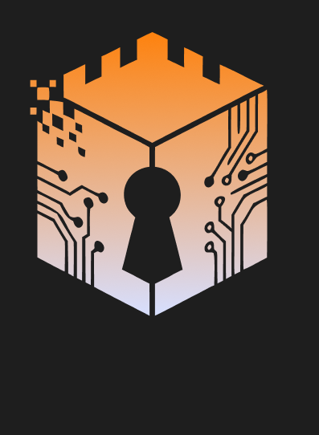
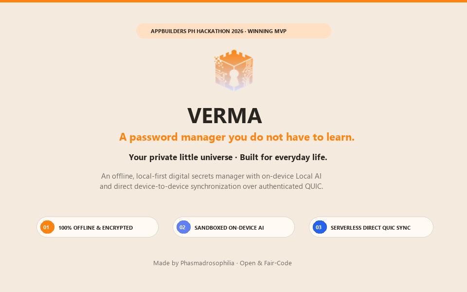

> **Design previews:** `pnpm preview:landing` → http://localhost:5127/;
> `pnpm preview:mobile` → http://localhost:5128/?demo=1#vault.
> Both accept `--port NUMBER`. See [reproducible previews](docs/preview-reproducibility.md).

<p align="center">
  
</p>

<h1 align="center">Verma</h1>

<p align="center"><strong>An offline AI, local-first password manager with a desktop app for more hands-off management of secrets and passwords.</strong></p>

<p align="center">
  <strong>Navigation</strong><br />
  <a href="#what-verma-is">What Verma is</a> ·
  <a href="#current-release-state">Current release state</a> ·
  <a href="#run-the-desktop-integration">Run the desktop integration</a> ·
  <a href="#what-is-included">What is included</a> ·
  <a href="#why-local-ai">Why Local AI</a> ·
  <a href="#local-versus-internet-behavior">Local versus internet behavior</a> ·
  <a href="#ai-model-status">AI model status</a> ·
  <a href="#known-limitations">Known limitations</a> ·
  <a href="#documentation-and-disclosures">Documentation and disclosures</a> ·
  <a href="#development-checks">Development checks</a>
</p>

<p align="center">
  
  
  
  
</p>

<p align="center">
  
</p>

## What Verma is

Verma is an offline AI, local-first password manager with a desktop app for people who want less manual work managing logins, notes, API keys, and password health. The goal is not to hand control of secrets to an assistant. It is to make routine organization, search, import, and health review more hands-off while keeping confirmation and secret access with the user.

The desktop app combines an Hono API, a local SQLite vault, explicit secret masking, deterministic password generation, Smart Import, Ask Your Vault metadata search, and direct device-sync workflows. AI assistance is designed around trusted-code redaction and local execution; the vault remains usable when AI is disabled or unavailable.

> [!NOTE]
> The primary hackathon release path is the desktop web application. The repository also contains mobile and mobile-preview work; mobile backend integration is tracked separately in issue [#55](https://github.com/Phasmadrosophila/Verma/issues/55) and is not the primary hackathon acceptance path.

## Current release state

> [!IMPORTANT]
> This repository is in feature freeze. The remaining work is documentation, verification, and release-blocking fixes only.

- The real desktop web-to-Hono integration is available through the local integration runner.
- Qwen3 0.6B is the app's configured local AI model through Ollama (`qwen3:0.6b`). Ask Your Vault falls back to deterministic metadata ranking when Ollama or the model is unavailable.
- The model is not bundled. `models/manifest.json` remains `tbd` for the exact production GGUF artifact, digest, provenance, and redistribution review; that release-artifact gate does not change the model used by the app.
- The self-hosted relay, heartbeat, and Dead Man's Switch are P1 prototype/test-mode work, not part of the P0 core vault release.
- No cloud AI service is used by the application path. The current adapter accepts loopback model endpoints only.

## Run the desktop integration

Prerequisites: Node.js 22 or newer and pnpm 12 (pinned via the `packageManager` field as pnpm@12.8.1; Corepack enabled). From a fresh clone, run `pnpm install`, then:

```powershell
pnpm dev:integration
```

> [!WARNING]
> This command is documented and implemented, but has not been re-run from a clean clone during this documentation pass. Treat clean-clone setup as **unverified** until `pnpm test:integration` and a browser check pass on the target machine.

The runner starts:

- Web application: `http://127.0.0.1:5173`
- API health check: `http://127.0.0.1:3000/health`
- Synthetic integration database: `.local/integration/vault.db`

The runner seeds sanitized fixtures, never prints the demo password or entry contents, and keeps web/API communication on loopback. Press `Ctrl+C` to stop it.

For the standalone landing/download preview, use `pnpm preview:landing` and open `http://localhost:3000`. This is a separate preview server from the desktop integration runner.

## What is included

- Vault lifecycle with initialization, lock/unlock, and recovery-phrase flows.
- Login, note, and API-key entries with explicit masking and reveal behavior.
- Cryptographically secure non-AI password generation using browser randomness.
- Smart Import for messy CSV data, deterministic mappings, duplicate preview, tags, staging, and explicit confirmation.
- Ask Your Vault over repository-projected metadata rather than secret values.
- Direct device pairing and sync workflows in the desktop application.
- A local AI adapter with schema validation and deterministic fallbacks when AI is disabled, unavailable, malformed, or timed out.
- P1 prototype/test-mode continuity components: self-hosted opaque-envelope relay, heartbeat concepts, and Dead Man's Switch test mode.

## Why Local AI

Password management is repetitive, sensitive, and easy to postpone. People accumulate logins, API keys, imports, duplicate entries, and password-health warnings, but reviewing and organizing them manually takes attention. Verma uses AI to make those routine tasks more hands-off without making the assistant the owner of the vault.

Running the assistant locally benefits Verma because vault metadata and user questions do not need to be sent to a cloud AI provider for search, import suggestions, or explanations. Local execution supports privacy, works during network outages, avoids a required cloud AI account, and keeps response behavior tied to the user's device. Trusted application code redacts denied fields before inference, and the user must review and confirm suggestions before changes are applied.

> [!NOTE]
> This is an application-level local-AI path, not a claim that the current repository already provides an audited air gap or OS-level sandbox. The app uses Qwen3 0.6B through an allowed Ollama loopback endpoint; the exact production GGUF artifact is not yet pinned in the release manifest.

## On-device versus internet-required processing

### Runs on the device today

| Capability | Current behavior |
| --- | --- |
| Vault storage and normal vault operations | Local Hono API and local SQLite database; usable without AI. |
| Secret masking and reveal behavior | Performed in the desktop application and API flow; secrets stay behind explicit user interaction. |
| Password generation | Deterministic application flow using browser cryptographic randomness; no AI or internet required. |
| Smart Import parsing and fallback mapping | CSV parsing, deterministic mapping, duplicate detection, staging, preview, and confirmation run locally. |
| Metadata projection for Ask Your Vault | Trusted code selects allowed metadata while the vault is unlocked and returns an empty AI view while locked. |
| AI endpoint boundary | The adapter rejects non-loopback hostnames before making its request; when no local model endpoint is running on loopback the request fails gracefully and falls back to deterministic metadata search. |
| Desktop web/API communication | Vite proxies to the local Hono API on `127.0.0.1`; the integration runner uses a local database and synthetic fixtures. |
| Direct-sync verification | Pairing, encryption, signatures, and sync logic are exercised locally in the verification suite. |

### Requires internet or an external transfer

| Activity | Current requirement or limitation |
| --- | --- |
| Installing dependencies | `pnpm install` normally requires access to the package registry unless dependencies are already cached. |
| Obtaining a model artifact | No model is bundled or selected. A future approved artifact must be acquired separately. |
| GitHub and pull-request workflows | Repository hosting, issue tracking, CI, and review require internet access. |
| Deployment and hosted asset delivery | Hosting, deployment, and any remote asset delivery are network-dependent. |
| Optional relay use | The P1 self-hosted opaque-envelope relay requires a reachable relay deployment; it is not required for the local vault or P0 local AI path. |
| Mobile physical-device integration | The separate Expo/mobile path may require a configurable LAN API URL; it is not the primary desktop release path. |

The core desktop vault and its deterministic fallback flows do not require a cloud AI service. The current repository does not implement a production `llama.cpp` launcher, model download flow, or OS-level network/filesystem sandbox. See [`docs/release/local-vs-online.md`](docs/release/local-vs-online.md) for the detailed evidence boundary.

## Local versus internet behavior

Normal vault, import, and API operations run in the local Hono process. The current AI adapter rejects configured non-loopback endpoints before making a request, and when no local model endpoint is running on loopback the request fails gracefully and falls back to deterministic metadata search. This is an application-layer loopback restriction, not proof of an OS-level network sandbox, read-only filesystem sandbox, or toolless model process.

No model artifact is bundled. If a model is selected later, a human will need to acquire it separately, which requires internet access or another transfer method. The current code does not implement model acquisition or a production `llama.cpp` launcher.

The exact current boundary and its open gaps are documented in [`docs/release/local-vs-online.md`](docs/release/local-vs-online.md) and [`docs/release/data-flow.md`](docs/release/data-flow.md). Do not interpret the application as zero-knowledge, air-gapped, or audited.

## AI model status

Qwen3 0.6B is the app's local AI model. Both local AI paths default to the Ollama tag `qwen3:0.6b`: Ask Your Vault uses it over redacted metadata, and Smart Import uses it for schema-constrained suggestions after trusted-code redaction. The API accepts loopback endpoints only and falls back to deterministic behavior when Ollama is disabled, missing, malformed, or times out.

The model is not bundled with the repository. `models/manifest.json` remains `tbd` only for the production artifact gate: the exact GGUF file, version, SHA-256, source, license evidence, and redistribution review still need to be pinned before a distributable release can claim a verified bundled artifact.

Model/runtime documentation:

- [`docs/runtime.md`](docs/runtime.md) — runtime boundary, manifest gate, and verification procedure.
- [`docs/model-selection-qwen3-0.6b.md`](docs/model-selection-qwen3-0.6b.md) — Qwen3 0.6B decision and alternatives.
- [`docs/model-evaluation-qwen3-0.6b.md`](docs/model-evaluation-qwen3-0.6b.md) — evaluation evidence status; currently not measured.
- [`docs/release/model-inventory.md`](docs/release/model-inventory.md) — release-facing artifact gate.
- [`models/manifest.json`](models/manifest.json) — authoritative machine-readable inventory.

## Known limitations

- The exact production GGUF artifact, version, SHA-256, license review, and redistribution decision are open; the app model is Qwen3 0.6B.
- No measured model latency, memory, throughput, accuracy, or quality result is available. Do not use the historical candidate numbers as release benchmarks.
- The repository contains no production `llama.cpp` launcher and no verified OS-level model network/filesystem sandbox.
- CSV redaction currently covers exact normalized headers `password`, `pass`, `pwd`, and `secret`; do not generalize this to every possible secret column.
- P1 relay, heartbeat, and Dead Man's Switch behavior is prototype/test mode and is not a replacement for the P0 vault or direct-sync acceptance criteria.

## Documentation and disclosures

- [`docs/disclosures.md`](docs/disclosures.md) — code/history, assets, dependencies, cloud boundary, model/framework status, and AI development-tool disclosure.
- [`docs/local-development.md`](docs/local-development.md) — local web/API integration details.
- [`docs/COMPETITION-HANDBOOK.md`](docs/COMPETITION-HANDBOOK.md) — competition requirements and evidence rules.
- [`docs/prd.md`](docs/prd.md) — product requirements and scope.

> [!NOTE]
> Verma's code license direction is **fair-code/source-available**. The specific final license and its commercial-use terms remain pending legal and release review, so no final license file or compatibility conclusion has been selected yet.

## Development checks

Install dependencies with `pnpm install`, then use the relevant checks:

```powershell
pnpm verify
pnpm check
pnpm test
pnpm test:integration
pnpm check:landing
```

These commands are repository-defined. Full clean-machine execution and release-device rehearsal remain verification tasks for the submission checklist.
