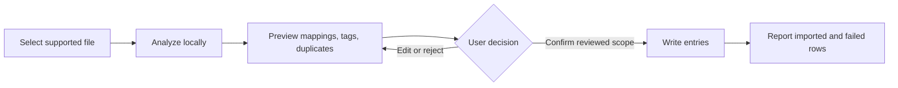

# Design System / UX Spec

> **Purpose:** consistent UX. Principles, components, tokens, patterns, accessibility.
> Traces back to: PRD user flows in `docs/prd.md` §§6–12 and the visual direction in the linked Figma frames.

**Product:** Verma  
**Status:** Hackathon MVP design source of truth  
**Primary surface:** desktop-first local vault application  
**Figma sources:** [Brand system and product study, node `26:125`](https://www.figma.com/design/kPNgVZLsWKOLppo9u4Q3ih/DESIGN-TOKEN?node-id=26-125&t=8ZSoSTEOHxhWok2L-4) · [Initial brand proposal, node `10:84`](https://www.figma.com/design/kPNgVZLsWKOLppo9u4Q3ih/DESIGN-TOKEN?node-id=10-84&t=8ZSoSTEOHxhWok2L-4)

The initial proposal supplies the warm, human direction, four source colors, Parkinsans, rounded shapes, and the line “What matters, stays with you.” The later brand system is authoritative where the two frames differ: the product is **Verma**, not the legacy “Haven” name in the initial proposal; daily vault organization leads; continuity and estate workflows are future extensions.

## Design principles

1. **Useful before impressive.** Lead with everyday jobs—importing, finding, opening, and syncing entries—not cryptography, protocols, AI spectacle, or estate-planning language. A first-time, non-technical user should see the next step without learning a vault taxonomy.
2. **Make trust boundaries visible.** Show whether work is local, offline, directly syncing, blocked, or awaiting review. Name what the AI can see and what remains hidden. Never depend on a privacy claim the interface cannot explain.
3. **Suggest, review, confirm.** AI output is always a proposal. Keep suggestions visually and verbally distinct from committed vault state; show a review step before mappings, tags, duplicate decisions, or conflict resolutions are written.
4. **Reveal secrets deliberately.** Search and assistant results expose metadata only. Keep every secret masked until an explicit, user-initiated unlock/reveal action. Locking immediately revokes AI metadata access.
5. **Stay calm when capability is reduced.** Offline, AI-disabled, model-unavailable, timeout, and partial-import states retain a usable manual vault. Use warm, specific guidance rather than alarm, blame, or false reassurance.

## Component inventory

| Component | Purpose and required behavior | Source |
| --- | --- | --- |
| App shell | Desktop title bar plus three working regions: vault navigation, task workspace, and contextual boundary/help panel. The Figma reference is 1312 × 796 px; preserve hierarchy rather than fixed dimensions. | Figma `27:4538` |
| Wordmark and compact V | Use the supplied vector artwork. Full wordmark for introductions and unfamiliar contexts; compact V only for square app-icon contexts. Never retype, stretch, rotate, crop, outline, shadow, or recolor with a new gradient. | Figma brand kit §§2–3 |
| Local status badge | Persistent, text-first state such as `Local mode · Offline`. Status must not rely on color. Distinguish local operation, direct sync, and blocked/error states. | Figma `27:4545`; PRD §7 |
| Vault navigation | Primary destinations: All items, Ask Your Vault, Smart Import, and Devices. Selected state requires icon, label, and shape treatment—not color alone. | Figma `27:4548`–`27:4562` |
| Vault state panel | Identifies demo/sanitized data, current lock state, and the explicit Lock/Unlock action. When locked, explain that AI metadata access is revoked. | Figma `27:4563`–`27:4567`; PRD §§9–10 |
| Button | `primary` uses orange fill with charcoal text; `secondary`/quiet uses cream or paper; `icon` remains visibly labelled by accessible name; `destructive` uses explicit destructive copy and confirmation. Press feedback is immediate and subtle. | Figma product actions; PRD §12 |
| Search prompt | Natural-language metadata query field with labelled submit action. Do not imply that secret fields are searched or sent to the model. | Figma `27:4571`–`27:4575`; AI-003 |
| Vault result card | Shows type icon, title, sanitized domain/tags, masked value, and explicit `Unlock to reveal`. Never reveal or announce the secret in result lists. | Figma `27:4576`–`27:4608` |
| Secret field | Masked by default. Reveal requires an unlocked vault and a deliberate control; copy is a separate deliberate action. The accessible label reports `Secret hidden` rather than reading mask characters. | PRD §§8–12 |
| Local AI boundary panel | Explains `On this device`, no-network operation, selected metadata fields, current availability, and the effect of locking or disabling AI. Periwinkle is supportive emphasis, never a competing primary action. | Figma `27:4609`–`27:4621` |
| Metadata field list/chip | Names categories visible to AI, such as demo titles, sanitized domains, tags, and categories. Do not list a field unless trusted code actually includes it in that workflow’s allowlist. | Figma `27:4614`–`27:4618`; PRD §9 |
| Smart Import stepper | Select source → analyze locally → preview mappings/tags/duplicates → confirm → report result. No record is written before confirmation. | IMPORT-001–005; Figma `27:4622`–`27:4636` |
| Mapping preview | Table-like review of source-to-vault fields, proposed tags, and duplicate groups. Every proposal is editable or rejectable. Preserve successfully reviewed rows if other rows fail. | AI-004–005; IMPORT-002–005 |
| Suggestion card | Visually labels generated content as a suggestion, includes the reason when practical, and provides accept/edit/reject actions. Accepted state is visibly different from proposed state. | PRD §§8, 12 |
| Tag/chip | Compact, removable metadata label. Tags organize entries; they do not expose secret values. Nested suggestions remain readable as text, for example `Google / Work / Company X`. | ENTRY-003; PRD §8 |
| Entry form | Supports login, note, and API-key entries for P0. Separate metadata fields from secret fields; validation is inline and does not echo secrets into errors or logs. | ENTRY-001–003 |
| Recovery phrase view | One-time, print-friendly presentation with explicit no-provider-recovery warning. Never expose recovery material to AI, telemetry, screenshots, or routine clipboard flows. | VAULT-001, VAULT-005; PRD §10 |
| Device pairing panel | Shows device identity, phrase/confirmation flow, and direct-sync state in user language. QR pairing is P1. Do not pitch QUIC as the user benefit. | PRD §§7, 10 |
| Confirmation dialog | Used for destructive actions, import commit, conflict resolution, recovery-sensitive steps, and emergency-package approval. State the object, consequence, and reversible path. | PRD §§6, 10, 12 |
| Status banner | Inline, persistent feedback for locked, offline, model-unavailable, timeout, malformed output, partial import, and sync-blocked states. Never place secrets in diagnostic text. | PRD §§8, 9, 12 |
| Toast | Confirms completed, low-risk actions only. It never replaces required review, a blocking error, or a recovery warning. Pause dismissal while focused or hovered. | UX implementation rule |
| Empty/loading/error state | Keeps the next manual action available. Loading names the operation; empty states teach one next step; errors state what failed, what remained unchanged, and how to continue. | PRD §12; handbook §11 |

### Brand asset rules

- Full wordmark minimum: **160 px digital / 30 mm print**. Use monochrome at small sizes.
- Compact tile minimum: **32 px**. At 24 px, use the V alone with a quarter-width internal margin.
- Clear space: at least **half the wordmark cap height** on every side.
- Avoid the gradient below **240 px wordmark width**.
- Primary full-color artwork retains its orange-to-periwinkle treatment. Monochrome charcoal is for utility surfaces and one-color output; cream is for dark surfaces.
- Pair the compact V with `Verma` in unfamiliar contexts.

## Tokens

### Color

| Token | Value | Role | Accessibility rule |
| --- | ---: | --- | --- |
| `--color-brand-orange` | `#FE820E` | Primary actions, warmth, invited next step | Use charcoal text; contrast is 6.04:1. Never use cream/white body text on orange. |
| `--color-brand-periwinkle` | `#607FF3` | AI/discovery support, not primary CTA | Charcoal contrast is 4.18:1: large text only. Prefer the lavender tint for normal text surfaces. |
| `--color-canvas` | `#F7EDE3` | Calm application canvas | Charcoal contrast is 13.04:1. |
| `--color-text` | `#292621` | Primary text, icons, dark surfaces | Default readable foreground. White on charcoal is 15.07:1. |
| `--color-text-muted` | `#716A61` | Secondary copy and metadata | 4.62:1 on cream and 5.22:1 on paper; do not reduce opacity. |
| `--color-border` | `#DED4CA` | Dividers and 1 px surface boundaries | Never the only indicator of focus, selection, or error. |
| `--color-paper` | `#FFFCF8` | Navigation and quiet surfaces | Use for long-form reading and low-emphasis panels. |
| `--color-surface` | `#FFFFFF` | Input and result-card surfaces | Reserve for working controls/cards so they separate from the cream canvas. |
| `--color-assist-surface` | `#E8EAFE` | AI explanation and discovery panel | Charcoal contrast is 12.65:1. Pair with explicit `On this device`/AI labels. |
| `--color-warm-surface` | `#FFE0BF` | Warm callout, warning, or review attention | Charcoal contrast is 11.96:1. Severity still requires icon and text. |

**Composition guidance:** cream 65%, charcoal 20%, orange 8%, periwinkle 7%. This is a visual balance, not a quota. Whitespace does most of the work.

**Semantic-state rule:** the current source palette does not define independent red/green semantic colors. Until validated semantic tokens are added, pair text and icons with paper, peach, or lavender surfaces. Never encode success, warning, danger, AI, lock, or sync state by hue alone.

### Typography

| Token / role | Family and weight | Size / line height | Use |
| --- | --- | ---: | --- |
| `--type-brand-display` | Fredoka 600 | 56 / 60 px | Brand headlines and promotional moments only |
| `--type-section-title` | Parkinsans 600 | 32 / 40 px | Major page/section title |
| `--type-interface-heading` | Parkinsans 600 | 24 / 30 px | Task and panel headings |
| `--type-body` | Parkinsans 400 | 16 / 24 px | Instructions and reading copy |
| `--type-label` | Parkinsans 500 | 12 / 18 px | Labels, metadata, and status text |
| `--type-emphasis` | Parkinsans 600 | Inherit role size | Purposeful emphasis, not whole paragraphs |
| `--type-code` | IBM Plex Mono 400 | 12 / 16 px minimum | Technical identifiers, hashes, versions, and code only |

- The proposal’s display specimen used unavailable Insaniburger artwork and labelled it `NOVA`. The supplied vector wordmark preserves that treatment; **do not substitute the wordmark with live text**.
- Use Fredoka only as the available rounded display substitute, not as a claim that it is NOVA.
- Sentence case in the interface. Left-align long copy. Target 45–75 characters per line.
- Parkinsans fallbacks: `"Parkinsans", "Google Sans", system-ui, sans-serif`.
- IBM Plex Mono fallback: `"IBM Plex Mono", ui-monospace, monospace`.

### Spacing

Use an **8 px rhythm** with 4 px half-steps for compact alignment.

| Token | Value | Typical use |
| --- | ---: | --- |
| `--space-1` | 4 px | Icon optical adjustment, tightly related metadata |
| `--space-2` | 8 px | Compact control internals |
| `--space-3` | 12 px | Label/control gap, chip padding |
| `--space-4` | 16 px | Standard control and card inset |
| `--space-5` | 20 px | Closely related panel content |
| `--space-6` | 24 px | Standard panel inset |
| `--space-8` | 32 px | Section separation |
| `--space-10` | 40 px | Large content group separation |
| `--space-12` | 48 px | Major section separation |
| `--space-16` | 64 px | Brand/document canvas margin |

Do not introduce one-off spacing when the nearest token preserves the intended hierarchy.

### Radius

| Token | Value | Use |
| --- | ---: | --- |
| `--radius-xs` | 4 px | Small indicators only |
| `--radius-sm` | 8 px | Compact controls and tags |
| `--radius-md` | 12 px | Navigation items and standard controls |
| `--radius-lg` | 24 px | Inputs, result cards, and panels |
| `--radius-xl` | 32 px | Large feature surfaces |
| `--radius-2xl` | 40 px | Brand-led modules and illustrations |
| `--radius-pill` | 999 px | Status badges and capsule buttons |

Large brand surfaces use 24–40 px radii. Avoid mixing several radii inside one component hierarchy without a functional reason.

### Borders and elevation

| Token | Value | Use |
| --- | --- | --- |
| `--border-subtle` | `1px solid #DED4CA` | Inputs, result cards, dividers, and surface separation |
| `--shadow-demo` | `0 12px 32px rgba(41, 38, 33, 0.07)` | Promotional/window mockup only |

The working product UI is flat. Prefer canvas/surface contrast and subtle borders over shadows. Do not add card shadows by default.

### Icons and imagery

- Simple outline icons at **20–24 px**. Important actions always include a text label or accessible name.
- Use arches, circles, leaves, and rounded tiles as a small repeated motif family.
- Keep expressive motifs outside dense working areas.
- Photography: warm paper, matte surfaces, daylight, and ordinary moments of relief or organization.
- Illustration: tactile forms, clear silhouettes, familiar devices, organized cards, and helpful hands.
- Avoid glossy 3D locks, shields, hacker clichés, fear-led stock imagery, neon “AI magic,” and gradients on every card.

### Motion

Motion is an implementation extension; the Figma source is static.

| Token | Value | Use |
| --- | ---: | --- |
| `--motion-press` | 120 ms | Press feedback; `scale(0.97)` on pressable controls |
| `--motion-small` | 160 ms | Tooltip, popover, and compact state transition |
| `--motion-standard` | 220 ms | Dialog/panel entry and non-repeated layout transition |
| `--ease-out` | `cubic-bezier(0.23, 1, 0.32, 1)` | Enter/exit and immediate response |
| `--ease-in-out` | `cubic-bezier(0.77, 0, 0.175, 1)` | On-screen movement/morphing |

- Animate only transform and opacity where possible. Never use `transition: all`.
- Do not animate keyboard-initiated or high-frequency navigation actions.
- Entry starts no smaller than `scale(0.95)`; never animate from `scale(0)`.
- Keep routine interface motion below 300 ms. Exit is equal to or faster than enter.
- Under `prefers-reduced-motion: reduce`, remove spatial movement and retain brief opacity/color feedback only.

## Patterns & states

### Suggestions and committed state

- Prefix or label generated output with `Suggestion`, `Suggested mapping`, `Suggested tags`, or an equally explicit noun.
- Keep `Accept`, `Edit`, and `Reject` adjacent to the suggestion being decided.
- The primary commit action states the scope, for example `Save 24 reviewed entries`, not `Continue`.
- After commit, replace suggestion styling with ordinary vault-state styling and report exactly what changed.
- A malformed or unavailable model cannot enable a commit action.

### Forms

- Put a persistent label above every field; placeholder text is an example, not a label.
- Mark required fields in text. Explain format before submission when it is non-obvious.
- Validate on blur and submit; do not validate every keystroke unless the feedback is constructive and stable.
- Place inline errors next to the field and focus the first invalid field after submit.
- Secret values, recovery material, note bodies, and file contents never appear in validation details, telemetry, debug panels, or model errors.
- Destructive actions use specific verbs (`Delete entry`, `Discard import`) and a confirmation when loss is not trivially reversible.

### Ask Your Vault

| State | Surface behavior |
| --- | --- |
| Empty | Explain that search uses selected metadata; offer one sanitized example query. |
| Ready | Input is enabled; secret fields remain masked; local/offline status remains visible. |
| Loading | Name the operation: `Searching selected metadata on this device…`; keep cancel/manual navigation available. |
| Results | State match count and searched metadata categories. Each card exposes metadata and `Unlock to reveal`, never a secret. |
| No match | Say `No metadata matches found`; offer ordinary vault search or query editing. Do not imply the entry does not exist. |
| Model unavailable/disabled | Explain the state and route to ordinary text search. The vault remains usable. |
| Locked | Disable AI query submission and state that metadata access is revoked. Provide explicit unlock action. |
| Malformed output | Discard the generated result, keep vault state unchanged, and offer retry/manual search without technical payloads. |

### Smart Import

- Before confirmation, keep the persistent boundary message: `Nothing saved yet. You confirm first.`
- Preview source field → destination field mappings, proposed tags, and likely duplicate groups separately.
- Never silently merge or discard duplicates.
- Failure summary preserves successfully reviewed rows and identifies failed rows without echoing secret values.
- Source content stays local; do not use cloud-upload language or animation.

### Lock and reveal

- `Lock vault` is always available from the authenticated shell.
- Locking immediately masks values, revokes AI metadata access, disables AI controls, clears sensitive transient UI, and moves focus to the locked-state heading.
- `Unlock to reveal` is per entry/result. Do not use hover to reveal.
- Copy/reveal controls have visible labels, keyboard access, and an announced state change.
- Do not auto-copy after unlock. Do not place revealed content in notifications.

### Sync and device state

- Use plain-language labels: `Local only`, `Syncing directly`, `Synced directly`, `Pairing required`, or `Sync blocked`.
- Pair state text with an icon and a short explanation. Periwinkle may support discovery; orange remains the next-step action.
- Separate local vault availability from sync availability. A network failure must not imply that local data is unavailable.
- Show conflicts as a queue requiring user resolution. AI may explain and recommend, but never resolves or discards automatically.
- QUIC, Ed25519, and SPAKE2 belong in technical details, not primary consumer labels.

### Empty, loading, error, and success states

- **Empty:** state what belongs here and provide one primary next step.
- **Loading:** use a descriptive status and preserve layout to avoid shifts. Skeletons must not resemble revealed secrets.
- **Error:** state what failed, what remained unchanged, and the next safe action. Keep raw exception text out of the user surface.
- **Partial success:** report successful and failed counts separately; never reduce this to a generic success toast.
- **Success:** confirm the object and action (`24 entries imported`), not a vague `Done`.
- **Offline:** treat offline local operation as a normal capability, not automatically as an error.

### Responsive behavior

- Desktop is the P0 target. At the 1312 px reference, use 216 px navigation, flexible task workspace, and a 308 px contextual panel.
- The task workspace owns remaining width; avoid horizontal scrolling in ordinary forms and search results.
- When the contextual panel cannot remain at a readable width, move it below the task instead of compressing body copy.
- Collapse navigation only with persistent labels available through the collapsed control and a complete keyboard path.
- Android/mobile is roadmap scope. Do not claim the desktop study is a finished mobile design.

## UI voice & copy rules (enforced, not optional)

Voice is warm, plain-spoken, specific, and calm. Name the object, state, boundary, and next action. Sentence case. Prefer short concrete sentences over reassurance adjectives.

### Surface invariants

| ID | Invariant | PRD source |
| --- | --- | --- |
| `INV-001` | AI is blind to every secret field and receives only a task-specific, code-generated redacted metadata view. | §§8–9; AI-002–003 |
| `INV-002` | AI suggests; the user reviews and confirms. Generated output never silently mutates the vault, resolves a conflict, or changes access. | §§6, 8, 12; AI-004–009 |
| `INV-003` | The UI distinguishes local, offline, direct-sync, cloud/roadmap, and blocked behavior honestly. | §§6–7, 12, 17 |
| `INV-004` | Password generation, strength, and reuse detection are deterministic; AI may only explain or prioritize findings. | §§4, 8, 15 |
| `INV-005` | Unlock and recovery are explicit. There is no hidden provider back door, and recovery material never reaches AI. | §§6, 9–10 |
| `INV-006` | Product, security, performance, availability, and licensing claims remain within measured MVP evidence. | §§4, 9, 14–19 |
| `INV-007` | The core vault remains usable when AI is disabled, unavailable, malformed, or offline. | §§1, 6, 8, 15 |
| `INV-008` | Secret content never appears in AI prompts, lists, telemetry, debug/error text, or automatic notifications; reveal is explicit. | §§9, 12, 15 |
| `INV-009` | Product identity is consistently `Verma`; legacy proposal names never appear in product or submission surfaces. | PRD heading; handbook §11 |

**Banned copy (enforced — tie each to its invariant):**

- Never use: `zero-knowledge AI`, `AI sees nothing`, or `the AI cannot see your data` — breaches **INV-001**. Use: `Local AI uses selected redacted metadata. It is blind to every secret field.`
- Never use: `Let AI fix it`, `Apply all automatically`, `Auto-resolve`, or `AI organized your vault` before confirmation — breaches **INV-002**. Use: `Review suggestions`, `Accept selected suggestions`, or `Save reviewed entries`.
- Never use: `cloud backup` or `synced to our servers` for local mode, or imply direct sync works without its required network/peer — breaches **INV-003**. Use: `Encrypted direct device-to-device sync, with no central server in local mode.`
- Never use: `AI-generated secure password`, `AI detected weak passwords`, or `AI found reused passwords` — breaches **INV-004**. Use: `Generated on this device using a cryptographically secure random source` or `Detected by deterministic checks; AI explanation is optional.`
- Never use: `We can recover your vault`, `Contact support to restore your recovery phrase`, or `automatic inheritance` — breaches **INV-005**. Use: `Keep your recovery material somewhere you can access without this device.`
- Never use: `unhackable`, `military-grade`, `completely safe`, `security audited`, `production ready`, or absolute privacy/safety claims — breaches **INV-006**. Use: `Hackathon MVP; not a security-audited production service.`
- Never use: `open source` while the license remains fair-code/source-available and under review — breaches **INV-006**. Use: `Fair-code / source-available direction; final license review pending.`
- Never present managed cloud, enterprise ACLs, Android, estate workflows, or the Dead Man’s Switch as shipped P0 behavior — breaches **INV-006**. Label them `Roadmap` or `Optional prototype continuity extension`.
- Never use: `AI required`, `Connect to continue`, or an AI-error message that blocks ordinary vault access — breaches **INV-007**. Use: `AI is unavailable. Continue with ordinary vault search.`
- Never include a password, token, recovery phrase, note body, or secret-derived excerpt in success/error copy — breaches **INV-008**. Use object type, count, and opaque event identifier only.
- Never ship the legacy name `Haven` from the initial proposal — breaches **INV-009**. The product name is `Verma`.
- Prefer `safest option identified by the current checks` over `safe`; prefer `matches found in selected metadata` over `AI found your password`; prefer `Secrets hidden` over decorative mask-only messaging.

### Approved message patterns

| Moment | Preferred copy |
| --- | --- |
| Introduction | `A password manager you do not have to learn.` |
| Supporting brand line | `What matters, stays with you.` |
| AI consent | `Local AI uses selected redacted metadata to help organize your vault. It is blind to every secret field.` |
| Import review | `These are suggestions. Review the mappings, tags and duplicate groups before saving.` |
| Write boundary | `Nothing saved yet. You confirm first.` |
| Locked vault | `Your vault is locked. AI metadata access has been revoked. Unlock to continue.` |
| AI unavailable | `Local AI is unavailable. Your vault still works; continue with ordinary search.` |
| Recovery | `Keep your recovery material somewhere you can access without this device.` |
| Local operation | `On this device` · `Local mode · Offline` |
| Search result | `{count} matches in titles, domains and tags · Secret values hidden` |

**Tool/default overrides (this project intentionally deviates):**

- Parkinsans is the product/body family; Fredoka is restricted to brand display; IBM Plex Mono is restricted to technical identifiers. Do not let a component library replace them with its default sans or monospace stack. Reason: the Figma system depends on a rounded but readable voice with technical typography kept exceptional.
- Browser/library primary buttons are overridden to orange with charcoal text. Do not use white text on orange; it fails the documented contrast requirement.
- Generic blue/purple “AI” gradients, sparkle icons, and magic copy are overridden by a flat lavender support surface plus explicit `On this device` and metadata-boundary copy. Reason: AI is a constrained copilot, not spectacle.
- Generic shadowed cards are overridden by flat paper/white surfaces and `--border-subtle`. Only promotional/window mockups use `--shadow-demo`.
- Generic success toasts do not replace persistent partial-import, lock, recovery, conflict, or sync states. Those states remain inline until resolved or acknowledged.
- No production component library is selected in the repository yet. Adoption of one must preserve these tokens, semantics, keyboard behavior, and copy invariants rather than importing its visual defaults unchanged.

**Provenance:** visual tokens, brand assets, component anatomy, and approved messages transcribed from Figma nodes [`26:125`](https://www.figma.com/design/kPNgVZLsWKOLppo9u4Q3ih/DESIGN-TOKEN?node-id=26-125&t=8ZSoSTEOHxhWok2L-4) and [`10:84`](https://www.figma.com/design/kPNgVZLsWKOLppo9u4Q3ih/DESIGN-TOKEN?node-id=10-84&t=8ZSoSTEOHxhWok2L-4). Behavioral rules and invariants come from `docs/prd.md`; competition disclosure constraints come from `docs/COMPETITION-HANDBOOK.md`. No production UI token file exists yet; when implementation begins, map these names one-to-one into code and update this line with the code path. **Last synced: 2026-10-09.**

## Accessibility standards

**Target:** WCAG 2.2 Level AA. This specification supports the target; full conformance still requires automated checks, keyboard review, screen-reader testing, zoom/reflow testing, contrast verification in implementation, and expert/manual review.

### Keyboard and focus

- Every action is reachable and operable by keyboard in a logical visual order.
- Use native controls first. Custom widgets implement the relevant ARIA Authoring Practices pattern completely.
- Visible focus ring: 2 px charcoal on light surfaces or 2 px cream on charcoal, with 2 px offset. Do not remove focus outlines without an equivalent.
- Dialogs move focus to the heading or first required field, trap focus while open, close with `Escape` when safe, and restore focus to the trigger.
- Provide a skip link to the task workspace.
- Keyboard-initiated navigation is immediate; do not delay it with animation.

### Contrast and color

- Normal text: at least 4.5:1. Large text: at least 3:1. UI components and focus indicators: at least 3:1 against adjacent colors.
- Charcoal on cream is the default reading pair. Charcoal on orange is valid for normal text.
- Charcoal on periwinkle and cream on periwinkle are large-text-only combinations. Cream/white text on orange is forbidden for readable copy.
- Color never carries state alone. Add a state word, icon, and where needed a structural treatment.

### Semantics and assistive technology

- One page-level `h1`; headings descend without skipped levels.
- Navigation, main workspace, contextual aside, forms, tables, and dialogs use native landmarks and names.
- Inputs have persistent labels, descriptions, and programmatic error associations.
- Import mapping uses a semantic table when comparison is row/column based; responsive alternatives preserve header relationships.
- Status changes use `role="status"`/polite live regions. Blocking failures use assertive announcement sparingly.
- Masked secrets are announced as `Secret hidden`, not as repeated bullet characters. Revealed values are not placed in live regions.
- Icons used alone have an accessible name; decorative motifs and repeated icons are hidden from assistive technology.

### Targets, text, zoom, and motion

- Pointer targets are at least 40 × 40 px on desktop and 44 × 44 px on touch surfaces; retain 8 px separation where adjacent actions are destructive or easy to confuse.
- Support 200% text zoom without clipped controls and 400% browser zoom/reflow for the core workflow without two-dimensional scrolling, except genuine data tables.
- Do not encode labels inside images. Preserve selectable text in product surfaces.
- Respect reduced-motion preferences; no flashing content; no automatic carousels or decorative continuous motion.
- Tooltips are supplementary. Required instructions and errors remain visible without hover.

## Key screen specs / wireframes

### 1. Vault shell / All items

**Goal:** ordinary vault use remains understandable with AI disabled.

- Title bar: `Verma / {vault name}` plus persistent local/offline/sync state.
- Left navigation: destinations, demo/sanitized-data note, lock action.
- Main workspace: search/filter, item list, create-entry action, explicit empty/loading/error states.
- Context panel: optional task explanation; never required to operate the vault.
- Secret values remain masked in every list row.

### 2. Ask Your Vault

**Reference:** Figma product study inside node `26:125`.

- Heading and one-line benefit: `Find what you need, in your own words.`
- Query field above results; submit is an orange icon button with an accessible label.
- Summary states count, metadata scope, and `Secret values hidden`.
- Result cards show identity and sanitized metadata, followed by a separate masked-secret boundary and `Unlock to reveal` action.
- Right panel explains local execution, selected fields, no-network state, and lock/disable behavior.
- Locked/model-unavailable states route to explicit unlock or ordinary text search rather than a dead end.

### 3. Smart Import review

**Goal:** convert messy input into reviewed structured entries without surprise writes.

- Introduction labels the feature as supporting/local assistance.
- Mapping preview compares source fields and destination fields.
- Tag suggestions and duplicate groups are separate review regions with per-item decisions.
- Sticky or persistent review summary states selected count, rejected count, duplicate decisions, and failed rows.
- Primary action names the write scope. Boundary text immediately below reads `Nothing saved yet. You confirm first.` until commit.
- Completion reports imported and failed counts separately and offers entry review.

### 4. Entry detail and explicit reveal

- Metadata is readable while secret controls remain visually grouped and masked.
- When locked, reveal and copy controls are replaced by one explicit unlock action.
- After unlock, reveal remains user initiated; do not reveal every field automatically.
- Edit mode distinguishes metadata from secret fields and names unsaved changes.
- Delete is separated from routine save actions and requires a specific confirmation.

### 5. Lock / unlock / recovery

- Locked screen identifies the vault, explains that AI metadata access is revoked, and offers unlock plus recovery help.
- Recovery-phrase creation is a dedicated flow: explain irrecoverability, reveal once, confirm recording, then leave no secret in history or normal navigation.
- Print/export is deliberate and warns about destination privacy.
- No support/back-door language.

### 6. Devices and direct sync

- List paired devices with human-readable name, identity verification state, last direct sync, and current availability.
- Pairing presents the word phrase and confirmation number as a mutual verification step; QR is P1.
- Separate `Local vault available` from `Direct sync unavailable` when the peer/network is absent.
- Conflicts enter a review queue. The assistant may explain differences but the user makes the resolution.

### 7. Optional continuity prototype (P1 only)

- Label the entire surface `Prototype` and `Test mode`; use fake recipient and emergency data.
- Package creation lists exact included material and requires explicit approval.
- Warning state shows the grace period and a prominent authenticated cancel path.
- Release never implies bypassing vault encryption; recipient authentication/recovery material remains required.
- Do not position this screen as the main product, guaranteed recovery, legal estate planning, or AI decision-making.
