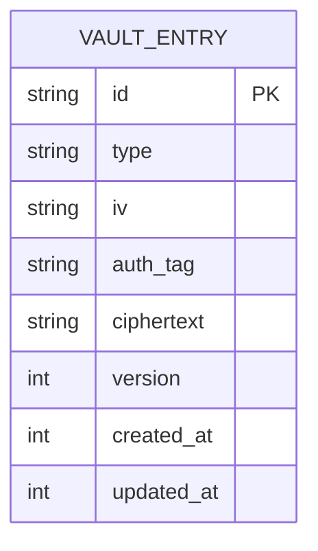

# Database and Data Model

Verma uses a local **SQLite** database (`better-sqlite3`) wrapped by encryption protocols (using `libsodium`) to ensure data is encrypted at rest.

## Core Schema

All vault entries are stored in a single table, treating SQLite effectively as an encrypted document store.

### `entries` Table
- `id` (TEXT, Primary Key): Unique identifier for the entry.
- `type` (TEXT): The type of entry (`login`, `note`, `api_key`).
- `iv` (TEXT): Initialization vector used during encryption.
- `auth_tag` (TEXT): Authentication tag to verify ciphertext integrity.
- `ciphertext` (TEXT): The fully encrypted JSON payload containing the actual entry data (titles, tags, and secrets).
- `version` (INTEGER): Schema version for backward compatibility during decrypt.
- `created_at` (INTEGER): Unix timestamp.
- `updated_at` (INTEGER): Unix timestamp.

## Encryption Flow

1. **Serialization**: The `VaultEntry` object is serialized into a JSON string.
2. **Encryption**: The JSON is encrypted using the in-memory master key (`libsodium.crypto_aead_xchacha20poly1305_ietf_encrypt`).
3. **Storage**: The `ciphertext`, `iv`, and `auth_tag` are persisted in the `entries` table.

## Data Types

### Login Entry
Contains: `username`, `password`, `url`, `domain`, `totpSecret`.

### Note Entry
Contains: `content`, `category`.

### API Key Entry
Contains: `service`, `apiKey`, `apiSecret`, `keyId`.

All entries share base metadata: `title`, `tags`, and lifecycle timestamps.

## Database Initialization
The database file is created dynamically at `./data/vault.db` (by default) when the server starts. The table schema is applied programmatically via SQLite `PRAGMA` and `CREATE TABLE IF NOT EXISTS` commands.
